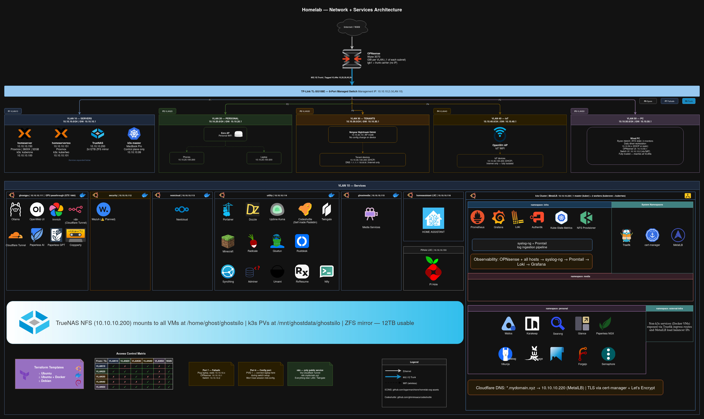

# Homelab

Infrastructure-as-code for a self-hosted homelab running on Proxmox, k3s, and Docker. Covers media automation, personal productivity, home automation, observability, and more — without depending on cloud services.



---

## Stack

| Layer | Technology |
|---|---|
| NAS / Storage | TrueNAS + ZFS + NFS |
| Hypervisor | Proxmox (2-node cluster) |
| Kubernetes | k3s (1 master + 2 workers) |
| Ingress | Traefik (Helm) + MetalLB |
| TLS | cert-manager + Let's Encrypt via Cloudflare DNS-01 |
| Identity | Authentik (OIDC / forward-auth) |
| Observability | Prometheus + Loki + Grafana + syslog-ng |
| Container runtime | Docker Compose (on Proxmox VMs) |

---

## Services

### Kubernetes (`myK8S/`)

**Media**
- [Sonarr](https://sonarr.tv) · [Radarr](https://radarr.video) · [Prowlarr](https://prowlarr.com) · [LazyLibrarian](https://lazylibrarian.gitlab.io)
- [RDT-Client](https://github.com/rogerfar/rdt-client) · [FlareSolverr](https://github.com/FlareSolverr/FlareSolverr)
- [Audiobookshelf](https://www.audiobookshelf.org) · [Kavita](https://www.kavitareader.com)

**Personal**
- [Paperless-ngx](https://docs.paperless-ngx.com) · [SearXNG](https://searxng.github.io/searxng) · [Karakeep](https://karakeep.app)
- [Wallos](https://github.com/ellite/Wallos) · [Glance](https://github.com/glanceapp/glance)

**Infrastructure**
- Authentik · Prometheus · Loki · Grafana · syslog-ng · Promtail

### Docker Compose (`docker/`)

[Immich](https://immich.app) · [Nextcloud](https://nextcloud.com) · [n8n](https://n8n.io) · [Ollama](https://ollama.com) + [Open WebUI](https://github.com/open-webui/open-webui)
[Portainer](https://www.portainer.io) · [Pi-hole](https://pi-hole.net) · [Uptime Kuma](https://github.com/louislam/uptime-kuma) · [Dozzle](https://dozzle.dev)
[Copyparty](https://github.com/9001/copyparty) · [Radicale](https://radicale.org) · [RustDesk](https://rustdesk.com) · [HomeAssistant](https://www.home-assistant.io)
[youtube-dl-server](https://github.com/nbr23/youtube-dl-server)

---

## Repository Structure

```
.
├── docker/                    # Docker Compose services
│   └── <service>/
│       ├── docker-compose.yaml
│       └── .env.example       # Copy to .env and fill in real values
│
├── myK8S/                     # Kubernetes manifests (k3s)
│   ├── <namespace>/<service>/
│   │   ├── <service>-pv.yaml
│   │   ├── <service>-pvc.yaml
│   │   ├── <service>-deployment.yaml
│   │   ├── <service>-service.yaml
│   │   ├── <service>-ingress.yaml
│   │   └── <service>-secrets.yaml.tmpl
│   ├── scripts/apply.sh       # envsubst + kubectl deploy helper
│   └── .env.example           # Copy to .env and fill in real values
│
├── terraform/                 # Proxmox VM provisioning
│   ├── modules/vm/            # Reusable VM module (telmate/proxmox)
│   ├── main.tf
│   ├── providers.tf
│   ├── variables.tf
│   ├── secrets.tfvars.example # Copy to secrets.tfvars — Proxmox API credentials
│   ├── homelab.tfvars.example # Copy to homelab.tfvars — VM name → IP definitions
│   └── ssh/                   # Place bootstrap.pub here (gitignored private key)
│
└── docs/
    ├── architecture-outline.md
    ├── content-plan.md
    └── blogs/outlines.md
```

---

## Secrets & Configuration

All secrets and local paths are kept out of version control. Every service has an `.env.example` showing which variables are required — copy it to `.env` and fill in your values.

### Docker

```bash
cd docker/<service>
cp .env.example .env
# Edit .env with your real paths and secrets
docker compose up -d
```

### Kubernetes

All manifests use `${VAR}` placeholders. Real values are injected at deploy time via `envsubst`.

```bash
cd myK8S
cp .env.example .env
# Edit .env with your NFS IPs, domain, secrets, etc.

# Deploy a manifest
./scripts/apply.sh authentik/authentik-secrets.yaml.tmpl

# Or manually
set -a; source .env; set +a
envsubst < authentik/authentik-secrets.yaml.tmpl | kubectl apply -f -
```

Typical apply order per service:
```bash
./scripts/apply.sh <service>-secrets.yaml.tmpl
./scripts/apply.sh <service>-pv.yaml
kubectl apply -f <service>-pvc.yaml
./scripts/apply.sh <service>-deployment.yaml
kubectl apply -f <service>-service.yaml
./scripts/apply.sh <service>-ingress.yaml
```

---

## Terraform — Proxmox VM Provisioning

VMs are provisioned from a Debian cloud-init template using the `telmate/proxmox` provider.

```bash
cd terraform

# 1. Copy and fill in credentials
cp secrets.tfvars.example secrets.tfvars

# 2. Copy and define your VMs
cp homelab.tfvars.example homelab.tfvars

# 3. Add your SSH public key
cp ~/.ssh/id_ed25519.pub ssh/bootstrap.pub

# 4. Init and apply
terraform init
terraform plan -var-file=secrets.tfvars -var-file=homelab.tfvars
terraform apply -var-file=secrets.tfvars -var-file=homelab.tfvars
```

VMs are assigned VMIDs sequentially from `vmid_start` (default: 300), ordered alphabetically by name for stable assignment across runs.

---

## Replicating This Setup

### Prerequisites

- A domain managed in Cloudflare (for DNS-01 TLS challenge)
- An NFS server (TrueNAS or any NFS export)
- k3s installed with `--disable traefik --disable servicelb`
- Helm for Traefik, MetalLB, cert-manager, Authentik

### Checklist

- [ ] Configure `myK8S/.env` from `.env.example`
- [ ] Configure `docker/<service>/.env` from each `.env.example`
- [ ] Apply namespaces: `kubectl apply -f myK8S/namespaces/`
- [ ] Deploy MetalLB and configure IP pool
- [ ] Deploy Traefik via Helm with `myK8S/traefik/traefik-values.yaml`
- [ ] Deploy cert-manager and configure `ClusterIssuer` with Cloudflare token
- [ ] Deploy services in dependency order (storage → app → ingress)

---

## DNS & Ingress

All services are exposed at `<service>.<your-domain>` via:

```
Cloudflare DNS (wildcard A record)
  → MetalLB LoadBalancer IP
    → Traefik
      → Kubernetes Service / ExternalName stub
        → App pod or Docker VM
```

External Docker services (Immich, Nextcloud, etc.) use a Service + EndpointSlice + Ingress stub in the `external-infra` namespace — Traefik routes the domain to the Docker VM IP without any pods.

---

## Observability

Every Docker VM cloned from the base template auto-starts:
- `node-exporter` — host metrics → Prometheus
- `cadvisor` — container metrics → Prometheus
- `dozzle-agent` — logs → central Dozzle
- `portainer-agent` — management → central Portainer

No manual setup required per host.

---

## License

MIT
