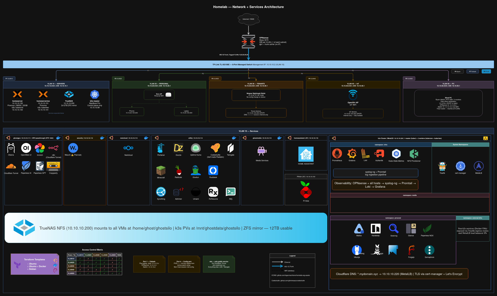

# Homelab

Everything here runs on hardware under my desk. This isn't a lab for lab's sake — it's the infrastructure I actually depend on daily. My photos, documents, finances, calendar, notes, and code all live here, not in someone else's cloud. Built on Proxmox, k3s, and Docker, managed entirely through code.



---

## What This Replaces

I've progressively de-Googled and moved off SaaS tools where it makes sense. These aren't just running — I use them every day.

| Replaced | With | How I use it |
|---|---|---|
| Google Drive | Nextcloud | Primary file sync across all devices. WebDAV for mobile apps. Shared folders for documents. |
| Google Photos | Immich | All photos backed up automatically from my phone. ML-powered face grouping, search, and albums. |
| Google Calendar | Radicale | CalDAV server. Calendar and contacts synced across devices via standard protocols. |
| Cloud Storage | TrueNAS (ZFS mirror) | ~10TB on-prem NAS — NFS backend for every service in this stack. Data stays home. |
| Notion / Obsidian Publish | Quartz | Internal wiki built from Obsidian notes, served as a static site. Personal knowledge base and runbooks. |
| Instapaper / Pocket | Wallabag | Read-later service. Articles saved from browser, readable offline. |
| Feedly | Miniflux | RSS reader. No algorithm, no ads — just feeds I chose. |
| Dropbox / Resilio | Syncthing | Decentralised peer-to-peer file sync. Used for keeping config and vault files consistent across machines without a central server. |
| Papertrail / Loggly | Loki + Grafana | All syslog and container logs centralised. Dashboards and alerts for every host. |
| Mint / YNAB | Actual Budget + UP API | UP bank transactions auto-synced into Actual Budget via a scheduled k8s cronjob. Full budget tracking, zero subscription. |
| Paperless / manual filing | Paperless-ngx | Physical documents scanned and ingested automatically. OCR'd, tagged, and searchable. Subdirectory-based tagging on ingest. |

---

## Infrastructure Stack

| Layer | Technology |
|---|---|
| NAS / Storage | TrueNAS + ZFS (mirror) + NFS |
| Hypervisor | Proxmox VE (2-node cluster) |
| VM Provisioning | Terraform (`telmate/proxmox` provider) + cloud-init |
| Configuration Management | Ansible (patching, Docker install, container updates) |
| Kubernetes | k3s (1 master + 2 workers across 2 Proxmox nodes) |
| Ingress | Traefik (Helm) + MetalLB (bare-metal LoadBalancer) |
| TLS | cert-manager + Let's Encrypt via Cloudflare DNS-01 |
| Identity / SSO | Authentik (OIDC, forward-auth) |
| Observability | Prometheus + Loki + Grafana + syslog-ng + Promtail |
| Container runtime | Docker Compose (per-VM, managed via Ansible) |

---

## Ansible

Playbooks manage the full VM fleet — Docker hosts and k3s nodes — from a single inventory.

**Inventory groups:**
- `docker_vms` — 5 Docker hosts (ghostgpu, security, nextcloud, utility, ghostmedia)
- `k3s_workers` — 2 k3s worker nodes
- `k3s_master` — k3s control plane
- `linux` — all of the above as a single target

**Playbooks:**

| Playbook | What it does |
|---|---|
| `update.yml` | `apt dist-upgrade` + `autoremove` across all Linux hosts. Cleans unused Docker volumes/images. Detects pending reboots and optionally reboots with `do_reboot=true`. |
| `docker-update.yml` | Iterates every Docker Compose stack and runs `docker compose pull && up -d` — rolling image update across all VMs in one command. |
| `install-docker.yml` | Idempotent Docker CE installation — adds GPG key, configures apt repo, installs packages, creates docker group, adds user. Run against any new VM with `-e target=<host>`. |

**Usage:**
```bash
# Patch all machines
ansible-playbook -i ansible/inventory.ini ansible/update.yml

# Patch and reboot if needed
ansible-playbook -i ansible/inventory.ini ansible/update.yml -e do_reboot=true

# Update all Docker stacks
ansible-playbook -i ansible/inventory.ini ansible/docker-update.yml

# Install Docker on a new VM
ansible-playbook -i ansible/inventory.ini ansible/install-docker.yml -e target=utility
```

Ansible runs are managed via [Semaphore](https://semaphoreui.com) — a self-hosted UI for scheduling and auditing playbook executions.

---

## Kubernetes (`myK8S/`)

k3s cluster with Traefik disabled at install — replaced with a Helm-managed Traefik deployment for full control over ingress configuration.

### Identity & Access

**Authentik** — self-hosted identity provider. Handles OIDC and forward-auth for services that support SSO. Deployed via Helm with a dedicated PostgreSQL backend.

### CI/CD — Forgejo + Forgejo Runner

**Forgejo** is the self-hosted Git server — all personal and homelab code lives here, not on GitHub. It runs Forgejo Actions (GitHub Actions-compatible), with a dedicated runner deployed as a k8s pod with Docker-in-Docker support.

Pipelines run on push: linting, builds, and deployments triggered automatically. The runner has access to the cluster via in-pod kubeconfig, so k8s manifests can be applied as part of a pipeline without leaving the private network.

### Observability Pipeline

Full log and metrics pipeline — every host and container feeds into a central stack:

```
Docker hosts / k3s nodes
  → node-exporter (host metrics)
  → cadvisor (container metrics)         → Prometheus → Grafana
  → kube-state-metrics (k8s state)

OPNsense / hosts
  → syslog-ng (UDP 514 ingestion)
  → Promtail                             → Loki → Grafana

Sitespeed.io (scheduled cronjob)
  → Graphite                             → Grafana
```

Grafana has custom dashboards, alerting rules, and data sources committed as code (`grafana-dashboards.yaml`, `grafana-alerting.yaml`, `grafana-datasources.yaml`).

### Networking & TLS

- **MetalLB** — assigns a static LoadBalancer IP to Traefik on bare metal
- **cert-manager** — provisions and renews TLS certificates automatically via Let's Encrypt Cloudflare DNS-01 challenge
- **Cloudflare DNS** — wildcard `*.yourdomain.com` → MetalLB IP → Traefik → service

External Docker services are exposed through the cluster via `ExternalName` Service stubs — no pods needed, Traefik routes the domain directly to the Docker VM IP.

### Terraform — VM Provisioning

VMs are provisioned from a cloud-init Debian template using the `telmate/proxmox` Terraform provider. Each VM gets: static IP, SSH key injection, user config, and NFS auto-mount via cloud-init.

```bash
cd terraform
cp secrets.tfvars.example secrets.tfvars   # Proxmox API credentials
cp homelab.tfvars.example homelab.tfvars   # VM definitions
terraform init && terraform apply -var-file=secrets.tfvars -var-file=homelab.tfvars
```

---

## Services

### Kubernetes

| Category | Services |
|---|---|
| Personal | Paperless-ngx · SearXNG · Karakeep · Wallos · Vikunja · Trilium · Wallabag · Miniflux · Glance · Homepage |
| Finance | Actual Budget (UP bank sync via scheduled cronjob) |
| Dev / Tools | Forgejo · Forgejo Runner · Semaphore (Ansible UI) |
| Identity | Authentik |
| Observability | Prometheus · Loki · Grafana · syslog-ng · Promtail · node-exporter · kube-state-metrics · Sitespeed · Graphite |
| Networking | Traefik · MetalLB · cert-manager |

### Docker Compose

| Category | Services |
|---|---|
| Productivity | Immich · Nextcloud · Syncthing · Quartz (wiki) · n8n · Umami |
| AI / LLM | Ollama + Open WebUI · PaperlessAI |
| Tools | Radicale (CalDAV) · Adminer · RxResume · Ntfy · RustDesk · Copyparty · Pi-hole · Uptime Kuma · youtube-dl-server · Home Assistant |
| Observability | Portainer · Dozzle |

---

## Repository Structure

```
.
├── ansible/                   # Playbooks and inventory
│   ├── inventory.ini          # All hosts grouped by role
│   ├── update.yml             # OS patching + Docker cleanup
│   ├── docker-update.yml      # Rolling Docker Compose updates
│   └── install-docker.yml     # Idempotent Docker installation
│
├── docker/                    # Docker Compose services
│   └── <service>/
│       ├── docker-compose.yaml
│       └── .env.example
│
├── myK8S/                     # Kubernetes manifests (k3s)
│   ├── <namespace>/<service>/ # Per-service: pv, pvc, deployment, service, ingress, secrets.tmpl
│   ├── scripts/apply.sh       # envsubst + kubectl deploy helper
│   └── .env.example
│
└── terraform/                 # Proxmox VM provisioning
    ├── modules/vm/            # Reusable VM module
    └── ssh/                   # bootstrap.pub (gitignored private key)
```

---

## Secrets Pattern

No real credentials exist anywhere in this repo. The pattern is consistent across all layers:

| Layer | Template | Real values |
|---|---|---|
| Docker | `.env.example` | `.env` (gitignored) |
| Kubernetes | `*-secrets.yaml.tmpl` + `myK8S/.env.example` | `myK8S/.env` (gitignored), generated via `envsubst` |
| Terraform | `secrets.tfvars.example` | `secrets.tfvars` (gitignored) |

---

## Observability — Every Host Covered Automatically

Every Docker VM is cloned from a base template that auto-starts four containers:

| Container | Port | Purpose |
|---|---|---|
| `portainer-agent` | 9001 | Registers with central Portainer |
| `dozzle-agent` | 7007 | Registers with central Dozzle |
| `node-exporter` | 9100 | Host metrics → Prometheus |
| `cadvisor` | 8080 | Container metrics → Prometheus |

A new VM is fully observable the moment it boots — no manual configuration.

---

## License

MIT
